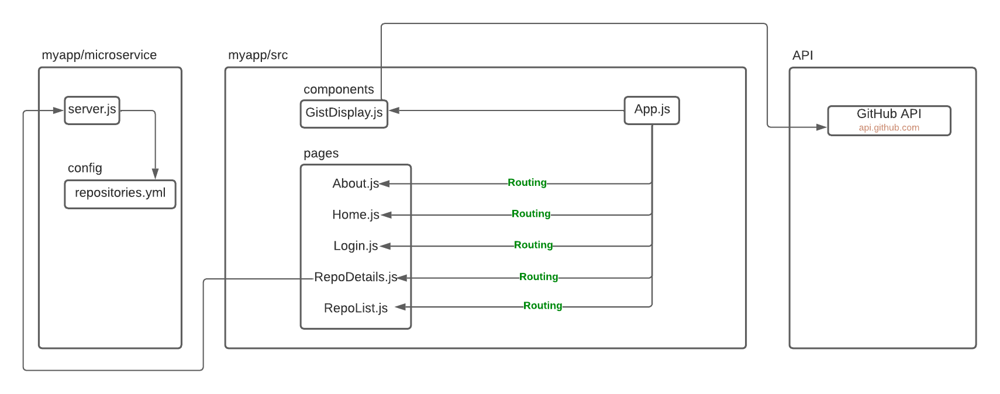

# Final Project Release
## Component Diagram

## Run and Test
The new modifications to the app is included in the Project Release 3. Follow the following steps to run the app in development mode.

### Step 1
Navigate to the follwoing path
```
./myapp/
```
### Step 2
Fetch the GitHub Access Token from the BlackBoard Submission. Create a `.env` file in `myapp/` directory. Paste the GitHub Access Token as follows
```
REACT_APP_GITHUB_ACCESS_TOKEN={YOUR_GITHUB_ACCESS_TOKEN}
```
### Step 3
Install Packages
```
npm install
```
### Step 4
Start the server and
Start the React App by running the following
```
npm start
```
### Step 5
#### Test the server
1. Go to `http://localhost:{PORT}/repositories` on a browser. 
Port should be 3000 by default. If not, refer back to the shell from where server was started.
2. Successfully running server should display a json response of all the repositories belonging to the GitHub User anuva-a.
3. Go to `http://localhost:{PORT}/repositories/{RepoName}/commits` on a browser.
4. Succesfully running server should display a json response of all the commits made in the provided {RepoName}
#### Test the app
1. Go to `http://localhost:{PORT}/repositories` on a browser. Port number can be found from the shell from where the app was started.
2. Navigate to the RepoList page by clicking on the `RepoList` button.
3. Successfully running the app should display the repository information fetched from the server on the RepoList page.
4. Clicking on any "View Commit" button under each Repository, the app should navigate to a new page which displays all the commits.
